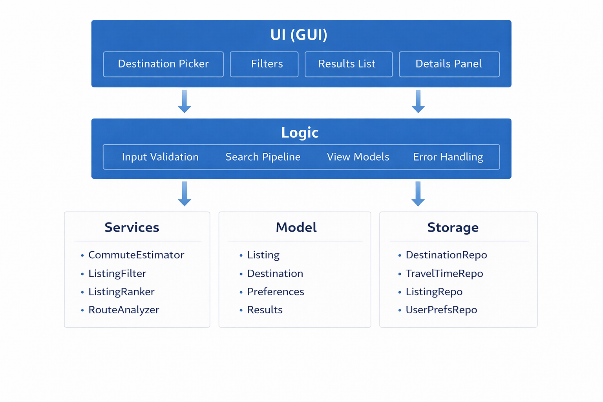

# Architecture Overview

**Smart Rental Search Algorithm**

## Design Decision

**Local data only** for destinations, commute-time lookup, and listings. No live APIs, geocoding, or real-time scraping.

---

## Component View


```
┌─────────────────────────────────────────────────────────────────┐
│                         UI (GUI)                                 │
│  • Destination selection (supported destination picker)          │
│  • Filter inputs (max rent, max commute, max walk, aircon, sort) │
│  • Results list/table                                            │
│  • Details panel/dialog (V1.4: commute breakdown)                │
└────────────────────────────┬────────────────────────────────────┘
                             │ User actions → Logic calls
                             │ Rendered SearchResultViewModel[]
                             ▼
┌─────────────────────────────────────────────────────────────────┐
│                          Logic                                   │
│  • Validate inputs                                               │
│  • Execute search pipeline (load → filter → estimate → rank)     │
│  • Provide view models for UI                                    │
│  • Centralize error handling                                     │
└──────┬──────────────────┬──────────────────┬────────────────────┘
       │                  │                  │
       ▼                  ▼                  ▼
┌──────────────┐  ┌──────────────┐  ┌──────────────────┐
│   Services   │  │    Model     │  │     Storage      │
│              │  │              │  │                  │
│ CommuteEst.  │  │ Listing      │  │ DestinationRepo  │
│ ListingFilter│  │ Destination  │  │ TravelTimeRepo   │
│ ListingRanker│  │ Preferences  │  │ ListingRepo      │
│ RouteAnalyzer│  │ Results      │  │ UserPrefsRepo    │
└──────────────┘  └──────────────┘  └──────────────────┘
```

---

## Components

### UI (GUI)

- Collects inputs from user
- Displays ranked results
- Restores last-used preferences on startup
- Displays listing details + commute breakdown (V1.4)

### Logic

- Sets up the search pipeline
- Exposes UI-friendly operations
- See [API Spec](../api/api-spec.md) for operations

### Services

| Service | Responsibility |
|---------|----------------|
| **CommuteEstimator** | Local travel-time lookup between listing origin nodes and selected destinations |
| **ListingFilter** | Rent/time constraints, aircon filter |
| **ListingRanker** | Scoring + selectable sorting |
| **RouteAnalyzer** | Walk-dominant detection, commute breakdown (V1.4) |

### Model

- Entities: `Listing`, `Destination`, `Preferences`, `Results`
- Immutable-ish; lightweight DTOs between layers

### Storage

- Loads local datasets: destinations, travel times, listings
- Persists last-used preferences for improved UX

---

## Data Flow

1. **User input** → UI captures destination, rent, commute, walking cap, aircon, result count, sort mode, and walk-dominant toggle
2. **Logic** loads data from Storage, invokes Services via pipeline
3. **ListingFilter** → **CommuteEstimator** → **RouteAnalyzer** (V1.4) → **ListingRanker** → ranked results
4. **UI** renders `SearchResultViewModel[]`

---

## Related Documents

- [Software Design Document](./sdd.md)
- [API Spec](../api/api-spec.md)
- [Mock API / Data Schemas](../api/mock-api.md)
